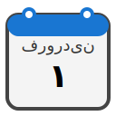

<p align="center">
    
</p>

<h1 align="center">Vue Persian Calendar</h1>

<p align="center" width="300px">
A comprehensive Vue 3 calendar and date picker component with support for Persian (Jalali), Hijri (Islamic), and Gregorian calendars
</p>

<br/>

This is a Vue 3 component library providing full-featured calendar and date picker components with automatic conversions between three calendar systems. Display and select dates across Persian (Jalali), Hijri (Islamic), and Gregorian calendars simultaneously with comprehensive event management, smart theming, and extensive customization options.

Visualize date selection directly on the calendar using mouse interaction or programmatic control. The component includes over 300 Persian holidays and observances, Islamic religious events, and international world days with smart event indicators and detailed tooltips.

# Features

- **Triple Calendar System** - Display Persian (Jalali), Hijri (Islamic), and Gregorian dates with automatic conversions
- **Comprehensive Events** - 300+ Persian holidays, Islamic events, and international observances with visual indicators
- **Two Component Options** - Full calendar view or compact datepicker with popup
- **Advanced Theming** - Light, dark, or auto-detection with per-color customization
- **Date Range Control** - Restrict selectable dates with `from` and `to` props
- **Accurate Conversions** - Precise Hijri conversion using lookup tables (1427-1464 AH)
- **TypeScript Support** - Complete type definitions for full IDE support
- **Extensive Customization** - 30+ slot-based customization points
- **Responsive Design** - Mobile-friendly with automatic popup positioning
- **High Performance** - Optimized rendering with computed properties

# Demo

[](https://codepen.io/mohamadhpp/pen/vELRmNa)

Try the component interactively. The demo showcases calendar selection, datepicker interaction, custom theming, and comprehensive event management.

View online demo: [Live CodePen Demo](https://codepen.io/mohamadhpp/pen/vELRmNa)

# Quick Start

## Installation

```bash
npm install vue-persian-calendar
```

## Basic Usage

```vue
<script setup>
import { PersianCalendar, PersianDatePicker } from 'vue-persian-calendar'
</script>

<template>
  <!-- Full calendar -->
  <PersianCalendar />
  
  <!-- Compact date picker -->
  <PersianDatePicker v-model="date" />
</template>
```

## Calendar Example

```vue
<script setup>
import { PersianCalendar } from 'vue-persian-calendar'

const handleSelectDate = (event) => {
  console.log(event.date)        // [1403, 6, 15]
  console.log(event.events)      // { persianEvents: [...], hijriEvents: [...], ... }
}
</script>

<template>
  <PersianCalendar
    theme="dark"
    @select-date="handleSelectDate"
  />
</template>
```

## Date Picker Example

```vue
<script setup>
import { ref } from 'vue'
import { PersianDatePicker } from 'vue-persian-calendar'

const selectedDate = ref(null)

const handleDateChange = (date) => {
  console.log('Date changed:', date)
}
</script>

<template>
  <PersianDatePicker
    v-model="selectedDate"
    format="text"
    @change="handleDateChange"
  />
</template>
```

# Browser Support

- Chrome/Edge (latest)
- Firefox (latest)
- Safari (latest)
- Mobile browsers (iOS Safari, Chrome Mobile)

# Accurate Date Conversions

The component uses precise conversion algorithms:

- **Jalali to Gregorian**: Accurate for all historical and future dates
- **Jalali to Hijri**: Uses lookup tables for years 1427-1464 AH with fallback calculations
- **Gregorian to Jalali**: Reverse conversion with high precision

# Event Categories

The calendar displays:

- **Persian Events**: 100+ official and commemorative days (رویدادهای ایرانی)
- **Hijri Events**: 50+ Islamic religious events (رویدادهای اسلامی)
- **World Events**: 200+ international observances (رویدادهای جهانی)

# License

MIT License - see [LICENSE](./LICENSE) file for details

# Contributing

Contributions are welcome! Please feel free to submit a Pull Request.

Steps to contribute:
1. Fork the repository
2. Create a feature branch (`git checkout -b feature/AmazingFeature`)
3. Commit changes (`git commit -m 'Add AmazingFeature'`)
4. Push to branch (`git push origin feature/AmazingFeature`)
5. Open a Pull Request

# Support

For issues, questions, or feature requests, please open an issue on GitHub.

Need help? Check the [Documentation](https://vue-persian-calendar.vercel.app/) or review the [Examples](./docs/guide/examples.md).

# Changelog

See [CHANGELOG.md](./CHANGELOG.md) for version history and updates.

# Credits

Built with Vue 3 and TypeScript for the Persian-speaking community and beyond.