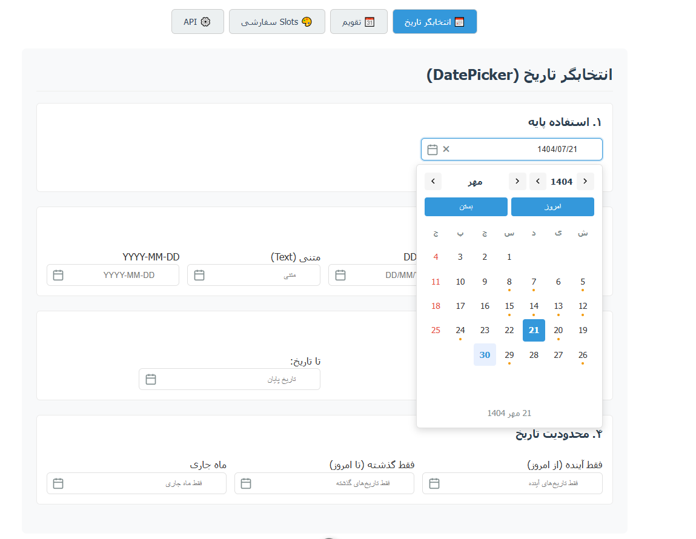

## Features Overview

### Multiple Calendar Systems

Display and convert between three major calendar systems:
- **Persian (Jalali)** - The official calendar of Iran
- **Hijri (Islamic)** - The lunar calendar used in Islamic communities
- **Gregorian** - The international standard calendar

Each date automatically shows all three calendar representations with accurate conversions.

### Comprehensive Event System

Automatically displays relevant events and observances:
- Persian national holidays and commemorative days
- Islamic religious events and holy dates
- International world observances
- Custom event support
- Visual event indicators on calendar dates
- Hover tooltips with event details

### Two Component Options

**PersianCalendar** - Full calendar view with:
- Month and year navigation
- Today indicator
- Selected date highlighting
- Event display panel
- Date information (Persian, Hijri, Gregorian)
- Customizable via named slots

**PersianDatePicker** - Compact date selection with:
- Popup calendar interface
- Input field with format options
- Quick action buttons (Today, Close)
- Automatic positioning (top/bottom)
- Clear date button
- v-model support

### Advanced Theming

- **Light Theme** - Clean, bright appearance for standard use
- **Dark Theme** - Eye-friendly dark colors for low-light environments
- **Auto Theme** - Automatically respects system preference
- **Custom Colors** - Override individual color values for both themes

### Date Constraints

Restrict date selection with the `from` and `to` props:

```vue
<PersianCalendar
  :from="[1403, 1, 1]"
  :to="[1403, 12, 29]"
/>
```

Perfect for:
- Booking systems
- Appointment scheduling
- Travel date selection
- Application deadlines
- Historical date ranges

## Quick Installation

```bash
npm install vue-persian-calendar-datepicker
```

## Basic Usage

### Simple Calendar

```vue
<script setup>
import { PersianCalendar } from 'vue-persian-calendar-datepicker'
</script>

<template>
  <PersianCalendar />
</template>
```

### Date Picker with v-model

```vue
<script setup>
import { ref } from 'vue'
import { PersianDatePicker } from 'vue-persian-calendar-datepicker'

const selectedDate = ref(null)
</script>

<template>
  <PersianDatePicker v-model="selectedDate" />
</template>
```

### With Date Range

```vue
<script setup>
import { PersianDatePicker } from 'vue-persian-calendar-datepicker'

const startDate = [1403, 1, 1]
const endDate = [1403, 12, 29]
</script>

<template>
  <PersianDatePicker
    :from="startDate"
    :to="endDate"
    placeholder="تاریخی را انتخاب کنید"
  />
</template>
```

### Theme Control

```vue
<script setup>
import { PersianCalendar } from 'vue-persian-calendar-datepicker'
</script>

<template>
  <!-- Light theme -->
  <PersianCalendar theme="light" />
  
  <!-- Dark theme -->
  <PersianCalendar theme="dark" />
  
  <!-- Auto-detect from system -->
  <PersianCalendar theme="auto" />
</template>
```

### Custom Colors

```vue
<script setup>
import { PersianCalendar } from 'vue-persian-calendar-datepicker'

const lightColors = {
  background: '#f0f0f0',
  text: '#222',
  selectedBg: '#4CAF50',
  selectedText: '#fff'
}

const darkColors = {
  background: '#1a1a1a',
  text: '#f5f5f5',
  selectedBg: '#66BB6A',
  selectedText: '#fff'
}
</script>

<template>
  <PersianCalendar
    :lightColors="lightColors"
    :darkColors="darkColors"
  />
</template>
```

## Component Reference

### PersianCalendar Props

| Prop | Type | Default | Description |
|------|------|---------|-------------|
| `from` | `number[]` | — | Start date `[year, month, day]` |
| `to` | `number[]` | — | End date `[year, month, day]` |
| `showInfo` | `boolean` | `true` | Show date information section |
| `showEvents` | `boolean` | `true` | Show events section |
| `showOccasions` | `boolean` | `true` | Show event markers on dates |
| `theme` | `'light' \| 'dark' \| 'auto'` | `'light'` | Theme mode |
| `fontFamily` | `string` | `'Tahoma, sans-serif'` | Font family |
| `defaultDate` | `number[] \| string` | — | Initial date |
| `lightColors` | `ColorScheme` | — | Light theme colors |
| `darkColors` | `ColorScheme` | — | Dark theme colors |

### PersianDatePicker Props

| Prop | Type | Default | Description |
|------|------|---------|-------------|
| `modelValue` | `number[] \| string \| null` | `null` | Selected date (v-model) |
| `format` | `string` | `'YYYY/MM/DD'` | Date format |
| `placeholder` | `string` | — | Input placeholder text |
| `disabled` | `boolean` | `false` | Disable the picker |
| `readonly` | `boolean` | `true` | Read-only input field |
| `clearable` | `boolean` | `true` | Show clear button |
| `position` | `'top' \| 'bottom' \| 'auto'` | `'auto'` | Popup position |
| `from` | `number[]` | — | Start date |
| `to` | `number[]` | — | End date |
| `showTodayButton` | `boolean` | `true` | Show today button |
| `showCloseButton` | `boolean` | `true` | Show close button |
| `showOccasions` | `boolean` | `true` | Show event tooltips |
| `theme` | `'light' \| 'dark' \| 'auto'` | `'light'` | Theme mode |

### PersianCalendar Events

```typescript
@select-date="(event: { date: number[], events: CalendarEvents }) => {}"
@update-today="() => {}"
```

### PersianDatePicker Events

```typescript
@update:modelValue="(date: number[] | null) => {}"
@change="(date: number[] | null) => {}"
@open="() => {}"
@close="() => {}"
```

## Methods

### PersianCalendar Methods

```typescript
// Set selected date
setDate(date: number[] | string | null): void

// Set date from Gregorian
setDateFromGregorian(gregorianDate: number[] | string): void

// Get selected date
getSelectedDate(): number[]

// Navigate to today
goToToday(): void
```

### PersianDatePicker Methods

```typescript
// Set selected date
setDate(date: number[] | string | null): void

// Set date from Gregorian
setDateFromGregorian(gregorianDate: number[] | string): void

// Get selected date
getSelectedDate(): number[] | null

// Select today
selectToday(): void

// Clear date
clearDate(): void

// Open/close popup
openPopup(): void
closePopup(): void
```

## Date Formats

Supported date formats for PersianDatePicker:

| Format | Example |
|--------|---------|
| `YYYY/MM/DD` | 1403/01/15 |
| `YYYY-MM-DD` | 1403-01-15 |
| `DD/MM/YYYY` | 15/01/1403 |
| `text` | 15 فروردین 1403 |

## Examples

### Booking System

```vue
<script setup>
import { ref } from 'vue'
import { PersianDatePicker } from 'vue-persian-calendar-datepicker'

const today = new Date()
const jy = today.getFullYear() + 1600
const jm = today.getMonth() + 1
const jd = today.getDate()

const checkInDate = ref(null)
const checkOutDate = ref(null)
</script>

<template>
  <div class="booking-form">
    <div class="form-group">
      <label>Check-in Date</label>
      <PersianDatePicker
        v-model="checkInDate"
        :from="[jy, jm, jd]"
        format="text"
      />
    </div>
    <div class="form-group">
      <label>Check-out Date</label>
      <PersianDatePicker
        v-model="checkOutDate"
        :from="checkInDate || [jy, jm, jd]"
        format="text"
      />
    </div>
  </div>
</template>
```

### Gregorian to Persian Conversion

```vue
<script setup>
import { ref } from 'vue'
import { PersianDatePicker } from 'vue-persian-calendar-datepicker'

const datepicker = ref(null)

const convertDate = () => {
  // Convert 2024-10-22 to Persian date
  datepicker.value.setDateFromGregorian([2024, 10, 22])
}
</script>

<template>
  <div>
    <PersianDatePicker ref="datepicker" />
    <button @click="convertDate">Convert Today</button>
  </div>
</template>
```

### Programmatic Date Control

```vue
<script setup>
import { ref } from 'vue'
import { PersianCalendar } from 'vue-persian-calendar-datepicker'

const calendar = ref(null)

const goToNewYear = () => {
  calendar.value.setDate([1404, 1, 1])
}

const getCurrentDate = () => {
  const date = calendar.value.getSelectedDate()
  console.log(date)
}
</script>

<template>
  <div>
    <PersianCalendar ref="calendar" />
    <button @click="goToNewYear">Go to 1404/1/1</button>
    <button @click="getCurrentDate">Log Current Date</button>
  </div>
</template>
```

## Demo

[](https://codepen.io/mohamadhpp/pen/vELRmNa)

In the playground folder, there is a example to explain the package. The demo version is also available online in the link below.

Show online demo: [Online Demo](https://codepen.io/mohamadhpp/pen/vELRmNa)

## Browser Support

- Chrome/Edge (latest)
- Firefox (latest)
- Safari (latest)

## Composable API

Access calendar utilities directly with the `usePersianCalendar()` composable:

```vue
<script setup>
import { usePersianCalendar } from 'vue-persian-calendar-datepicker'

const {
  today,
  persianMonthName,
  jalaliToGregorian,
  jalaliToHijri,
  getDayEvents
} = usePersianCalendar()
</script>
```

## License

MIT Licensed | Copyright © 2024

## Contributing

Contributions are welcome! Please feel free to submit a Pull Request.

## Support

For issues, feature requests, or questions, please visit the GitHub repository.